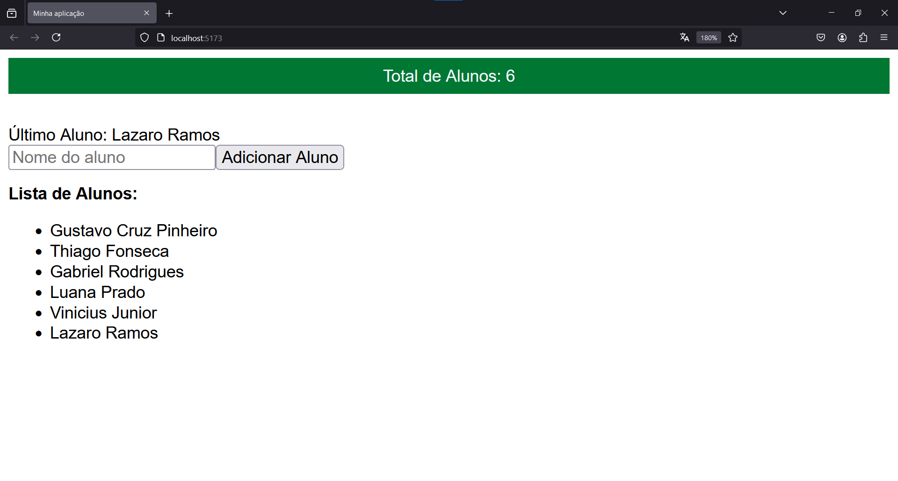

# React Context Alunos


O objetivo do projeto foi praticar a criação de context com react, para tanto foi criado um site de gerenciamento de alunos.



## 🛠 Tecnologias

As seguintes ferramentas foram usadas na construção do projeto:

* React;
* Vite;
* TypeScript;
* React Router Dom; e
* VSCode.

## 🚀 Como executar o projeto

```bash

# Clone este repositório
$ git clone https://github.com/Gustavo-Cruz-Pinheiro/react-context-alunos.git

# Acesse a pasta do projeto no seu terminal/cmd
$ cd react-context-alunos

# Instale as dependências com
$ npm i

# Execute o arquivo comando para executar o projeto
$ npm run dev

# O seu projeto estará rodando no localhost:3000

```

## 👨🏽‍💻 Autor

Gustavo Cruz Pinheiro

### 🌐 Me siga nas redes sociais

<a href="https://github.com/Gustavo-Cruz-Pinheiro"></a>
<a href="https://www.instagram.com/gusttavo.cruz_"></a>
<a href="https://www.facebook.com/gustavocruzpinheiro"></a>
<a href="https://www.linkedin.com/in/gustavo-cruz-pinheiro-61b852217/"></a>
